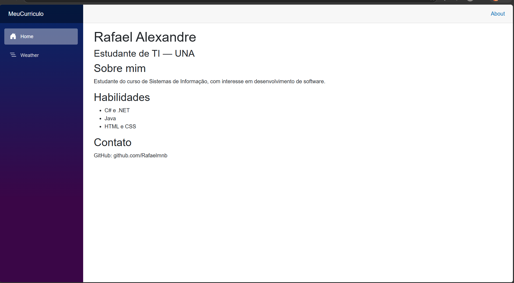

# MeuCurriculo — Blazor

**Nome:** Rafael Alexandre  
**Curso:** Sistemas de Informação — Centro Universitário UNA

## Como executar

```bash
dotnet run
```

Acesse no navegador: `https://localhost:5001`

## Tecnologia utilizada

Blazor (.NET) — framework web da Microsoft para C#

## Screenshot




## Heurística aplicada

**Ajuda e documentação**: O README fornece instruções claras de execução, facilitando o uso mesmo sem conhecimento prévio do projeto.
